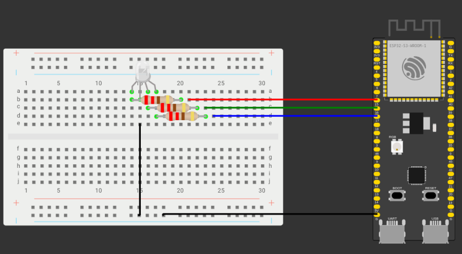

# MQTT-Lab

Welcome to MQTT-Lab! In this practice, we utilize two ESP32 boards to create an interactive and visually system.

## Project Description

In this project, one ESP32 acts as a distance sensor using the HC-SR04 ultrasonic sensor.
This ESP32 measures the distance and sends the information via MQTT (Message Queuing Telemetry Transport)
to another ESP32.

The second ESP32 acts as a receiver, receiving MQTT messages and controlling a RGB-Led based on the 
measured distance. The idea is to illuminate the LEDs proportionally to the distance, creating an intuitive
visual indicator.

## Components Used

- 2 ESP32 microcontrollers
- HC-SR04 ultrasonic sensor
- RGB-Led
- Cables
- Bread board
- Resistors (220 Ohm)

## Mosquitto MQTT Broker installation

We need to install the Mosquitto MQTT Broker in a computer. The installation instructions can be found 
[here](https://mosquitto.org/download/).  
We also made a docker image with the Mosquitto MQTT Broker installed and configured. 
The docker image can be found [mosquitto-docker](dokcer).

## Arduino IDE 2.0

We need to install the Arduino IDE to program the ESP32 boards.
The installation instructions can be found [here](https://www.arduino.cc/en/Guide/HomePage).  
We also need to install the ESP32 board in the Arduino IDE. The installation instructions can be found
[here](https://randomnerdtutorials.com/installing-esp32-arduino-ide-2-0/)

## Publisher ESP32

For the publisher we need an ESP32, a HC-SR04 ultrasonic sensor and a bread board.
The HC-SR04 sensor has 4 pins: VCC, GND, TRIG and ECHO. The VCC and GND pins are connected to the ESP32 3.3V and GND pins, respectively.
The TRIG and ECHO pins are connected to the ESP32 GPIO pins 11 and 12, respectively.  
  
The connection diagram is shown below:


### Libraries for the Publisher

We need to install the following libraries from the Arduino IDE Library Manager:

- PubSubClient
- WiFi

Then we can download the code from the [publisher](publisher) folder.

### Code explanation

The code is divided in 3 main parts: WiFi connection, MQTT connection and distance measurement.

#### WiFi connection

In this part we connect to the WiFi network. We need to change the ssid and password to match our network.
```c
const char* ssid = "****";
const char* password = "****";
```
#### MQTT connection

In this part we connect to the MQTT broker. We need to change the broker address and port to match our broker.
```c
const char* broker_ip = "";
const int mqtt_port = 1883;
```

#### Distance measurement

In this part we measure the distance using the HC-SR04 sensor. The sensor works by sending a pulse through 
the TRIG pin and measuring the time it takes to receive the pulse back through the ECHO pin. 
The time it takes to receive the pulse back is proportional to the distance.
The code below shows how we measure the distance.
```c
float get_distance(){


  digitalWrite(TRIG_PIN, LOW);
  delayMicroseconds(2);

  digitalWrite(TRIG_PIN, HIGH);
  delayMicroseconds(TRIG_PULSE_DURATION_US);
  digitalWrite(TRIG_PIN, LOW);

  ultrasonic_duration = pulseIn(ECHO_PIN, HIGH);

  return ultrasonic_duration * SOUND_SPEED/2*0.0001;
}
```

## Subscriber ESP32

For the subscriber we need an ESP32, a RGB-Led and a bread board.
The RGB-Led has 4 pins: R, G, B and GND. The R, G and B pins are connected to the ESP32 GPIO pins 15, 16
and 17, respectively. The GND pin is connected to the ESP32 GND pin.  
  
The connection diagram is shown below:



### Libraries for the Subscriber

We need to install the following libraries from the Arduino IDE Library Manager:

- PubSubClient
- WiFi

Then we can download the code from the [subscriber](subscriber) folder.

### Code explanation


The code is divided in 3 main parts: WiFi connection, MQTT connection and RGB-Led control.

#### WiFi connection

In this part we connect to the WiFi network. We need to change the ssid and password to match our network.
```c
const char* ssid = "****";
const char* password = "****";
```

#### MQTT connection

In this part we connect to the MQTT broker. We need to change the broker address and port to match our broker.
```c
const char* broker_ip = "";
const int mqtt_port = 1883;
``` 
We also have the OnMqttReceiver function, which is called whenever a MQTT message is received.
```c
void OnMqttReceiver(char * topic, byte * payload, unsigned int length){


  Serial.print("Received on ");
  Serial.print(topic);
  Serial.print(": ");

  String content = "";
  for (size_t i = 0; i < length; i++){
        content.concat((char)payload[i]);
  }
  Serial.print(content);
  Serial.println();
  int distance = content.toInt();
  updateLedColor(distance);

}
```

#### RGB-Led control

In this part we control the RGB-Led based on the distance received from the publisher.
The code below shows how we control the RGB-Led.
```c    
void updateLedColor(int distance)
{
  if (distance < 50)
  {
    analogWrite(pinR, 255);
    analogWrite(pinG, 0);
    analogWrite(pinB, 0);
  }
  else if (distance < 100)
  {
    analogWrite(pinR, 0);
    analogWrite(pinG, 255);
    analogWrite(pinB, 0);
  }
  else
  {
    analogWrite(pinR, 0);
    analogWrite(pinG, 0);
    analogWrite(pinB, 255);
  }
}
```

## Running the project

To run the project we need to start the [Mosquitto MQTT Broker](#mosquitto-mqtt-broker-installation) 
and upload the code to the ESP32s.

## Troubleshooting

If you have any problems, feel free to contact us or open an issue in this repository.

- Make sure the broker address and port are correct and that the broker is running.
- Make sure the WiFi ssid and password are correct.
- Make sure the ESP32s are connected to the same network as the broker.
- Make sure the ESP32s are connected to the correct pins.
- If you are using Linux make sure the user has permission to use the serial port. → [How to](https://askubuntu.com/questions/58119/changing-permissions-on-serial-port).


